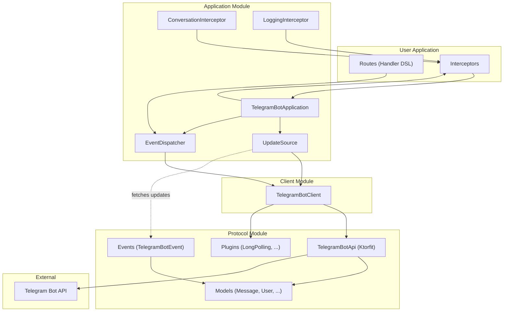

# Kotlin Telegram Bot API

[](https://kotlinlang.org/)

A Kotlin Multiplatform library for the [Telegram Bot API](https://core.telegram.org/bots/api). It provides type-safe,
auto-generated API bindings from the Telegram Bot API OpenAPI specification
using [Ktorfit](https://github.com/Foso/Ktorfit).

## Features

- **Multiplatform**: JVM, Android, JS, WASM, Linux, macOS, Windows, iOS, watchOS, tvOS, Android Native
- **Type-safe**: Auto-generated models and API interfaces from OpenAPI specification
- **Coroutine-based**: Built with Kotlin coroutines for asynchronous operations
- **Modular architecture**: Use only what you need

## Architecture



### Request Flow

1. **Update Fetching**: `UpdateSource` (e.g., long polling) fetches updates from Telegram via `TelegramBotClient`
2. **Event Conversion**: Raw `Update` objects are converted to typed `TelegramBotEvent` subclasses
3. **Interceptor Pipeline**: Events pass through the interceptor chain (onion model)
4. **Event Dispatching**: `EventDispatcher` routes events to matching handlers
5. **Response**: Handlers use `TelegramBotClient` to send responses back to Telegram

## Modules

### [protocol](protocol)

Provides auto-generated Telegram Bot API definitions. While designed for Ktorfit, it can theoretically be used with
other frameworks.

- **Model classes**: Kotlin data/sealed types for Telegram entities (`Message`, `User`, `Chat`, etc.)
- **API interface**: Ktorfit-based interface with `@GET`, `@POST`, `@Body`, `@Query` annotations
- **Multipart form wrappers**: For file uploads with `InputFile` sealed type
- **Query/Body extensions**: Ergonomic extension functions for API calls
- **Handwritten utilities**: `TelegramResponse`, `InputFile`, client plugins, exception types

### [client](client)

A high-level Telegram Bot API client wrapper for making HTTP requests.

- Pre-configured with sensible defaults
- Automatic retry for transient failures and rate limiting
- Test environment support
- Built-in long polling optimization
- File download support

### [application](application)

A Telegram bot framework with lifecycle management. **Generally, this is all you need.**

- **Lifecycle management**: Start/stop with graceful shutdown
- **Update sources**: Long polling, webhook (separate module), mock (for testing)
- **Handler DSL**: Type-safe routing for events (commands, messages, callbacks, etc.)
- **Command DSL**: Structured command parsing with typed arguments and subcommands
- **Interceptor pipeline**: Onion-model middleware for cross-cutting concerns
- **Conversation support**: Multi-turn conversation FSM
- **Structured concurrency**: Safe coroutine management

## Quick Start

### Add Dependency

```kotlin
// build.gradle.kts
implementation("com.hiczp.telegram.bot:application:$version")
```

### Minimal Bot

```kotlin
val routes = handling {
    commandEndpoint("start") {
        sendMessage("Welcome!")
    }
    commandEndpoint("ping") {
        replyMessage("pong")
    }
}

val app = TelegramBotApplication.longPolling(
    botToken = "YOUR_BOT_TOKEN",
    eventDispatcher = HandlerTelegramEventDispatcher(routes)
)

app.start()
app.join() // Suspend until stopped
```

Handlers receive a context with extension functions like `sendMessage`, `replyMessage`, `answerCallbackQuery` for
convenient API calls. The `client` and `event` are also available for direct access.

### Advanced Configuration

For more control, use the `TelegramBotApplication` constructor directly with custom components:

```kotlin
val client = TelegramBotClient(botToken = "YOUR_BOT_TOKEN")
val updateSource = LongPollingTelegramUpdateSource(
    client = client,
    allowedUpdates = listOf("message", "callback_query"),
    processingMode = ProcessingMode.CONCURRENT_BATCH,
    maxPendingUpdates = 50
)

val app = TelegramBotApplication(
    client = client,
    updateSource = updateSource,
    interceptors = listOf(loggingInterceptor()),
    eventDispatcher = HandlerTelegramEventDispatcher(routes)
)
```

This allows:

- Custom `TelegramBotClient` configuration
- Custom `TelegramUpdateSource` (e.g., webhook, mock for testing)
- Fine-grained control over processing mode and concurrency

## Usage Examples

### Event Handling

```kotlin
val routes = handling {
    // Message events
    onMessageEvent {
        whenMessageEventText("hello") {
            sendMessage("Hello!")
        }
        whenMessageEventTextRegex(Regex("(?i)^hello")) {
            sendMessage("Hi there!")
        }
        whenMessageEventPhoto {
            sendMessage("Nice photo!")
        }
    }

    // Callback query events
    onCallbackQueryEvent {
        whenCallbackQueryEventData("confirm") {
            answerCallbackQuery("Confirmed!")
        }
    }

    // Inline query events
    onInlineQueryEvent {
        whenInlineQueryEventQueryStartsWith("search") {
            // Handle inline search
        }
    }
}
```

### Command Handling

```kotlin
class BanArgs : BotArguments("Ban a user") {
    val username: String by requireArgument("Username to ban")
    val duration: String? by optionalArgument("Ban duration")
}

val routes = handling {
    // Simple command
    commandEndpoint("help") {
        sendMessage("Available commands: /start, /help, /ban")
    }

    // Command with typed arguments
    command("ban", ::BanArgs) {
        val username = arguments.username
        val duration = arguments.duration
        sendMessage("Banned $username${duration?.let { " for $it" } ?: ""}")
    }

    // Command with subcommands
    command("admin") {
        handle { showAdminHelp() }
        subCommandEndpoint("status") { showStatus() }
        subCommand("user") {
            subCommandEndpoint("list") { listUsers() }
            subCommandEndpoint("add") { addUser() }
        }
    }

   // Command with default error handling (automatically sends help on parsing errors)
   command("kick", ::BanArgs) {
      // If arguments fail to parse, help message is sent automatically
      kickUser(arguments.username)
   }

   // Command with custom parse-error handling
   command("mute", ::BanArgs, onError = { e ->
      sendMessage("Invalid command: ${e.message}")
   }) {
      muteUser(arguments.username)
   }

   // If you want to catch CommandParseException in an interceptor,
   // rethrow it from onError first.
   command("strict", ::BanArgs, onError = { e -> throw e }) {
        kickUser(arguments.username)
    }
}
```

### Chat Type Filters

```kotlin
onMessageEvent {
    whenMessageEventPrivateChat {
        // Private chat only
    }
    whenMessageEventGroupChat {
        // Group chat only
    }
    whenMessageEventSupergroupChat {
        // Supergroup only
    }
}
```

### Generic Matchers

For custom matching conditions, use the generic matchers:

```kotlin
val adminUserIds = setOf(123456L, 789012L)

onMessageEvent {
    // match - composable, takes a build lambda for nesting
    match({ it.event.message.text?.length ?: 0 > 10 }) {
        whenMessageEventTextContains("urgent") {
            sendMessage("Long urgent message!")
        }
    }

    // whenMatch - terminal, takes a handler directly
    whenMatch({ it.event.message.text?.length ?: 0 > 10 }) {
        sendMessage("Long message!")
    }

    // Logical combinators - composable versions
    allOf(
        { it.event.message.text != null },
        { it.event.message.chat.id == 100L }
    ) {
        whenMessageEventTextContains("hello") {
            sendMessage("Hello in chat 100!")
        }
    }

    anyOf(
        { it.event.message.photo != null },
        { it.event.message.video != null }
    ) {
        sendMessage("Photo or video!")
    }

   not({ it.event.message.isCommand }) {
        sendMessage("Not a command")
    }

    // Terminal versions of combinators (take handler directly)
    whenAllOf(
        { it.event.message.text != null },
        { it.event.message.from?.id in adminUserIds }
    ) {
        sendMessage("Admin text message")
    }

    whenAnyOf(
        { it.event.message.photo != null },
        { it.event.message.video != null }
    ) {
        sendMessage("Media message")
    }

   whenNot({ it.event.message.isCommand }) {
        sendMessage("Not a command")
    }
}
```

### Fallback Handler

A root-level `handle` acts as a catch-all for unhandled events:

```kotlin
val routes = handling {
    commandEndpoint("start") { /* ... */ }
    commandEndpoint("help") { /* ... */ }

    // Catches all unhandled events (unknown commands, other event types, etc.)
    handle {
        sendMessage("Unknown command. Type /help for available commands.")
    }
}
```

**Note**: Child routes always take precedence over `handle`, regardless of declaration order.

### Route Modularization

Use `include` to compose routes from multiple modules:

```kotlin
val adminRoutes = handling {
    commandEndpoint("admin") { /* ... */ }
}

val userRoutes = handling {
    commandEndpoint("profile") { /* ... */ }
}

val mainRoutes = handling {
    commandEndpoint("start") { /* ... */ }
    include(adminRoutes)
    include(userRoutes)
}
```

### Interceptors

```kotlin
val app = TelegramBotApplication.longPolling(
    botToken = "YOUR_TOKEN",
    interceptors = listOf(
        loggingInterceptor(),  // Built-in logging
        // Custom interceptor
        { context ->
            println("Before: ${context.event.updateId}")
            this.process(context)
            println("After: ${context.event.updateId}")
        }
    ),
    eventDispatcher = dispatcher
)
```

### Middleware

Middleware allows you to wrap handlers with pre/post processing logic for cross-cutting concerns such as authentication,
logging, metrics, or conditional execution.

Unlike regular matchers, middleware supports **suspend functions** in the `predicate`, enabling async operations like
database lookups or API calls:

```kotlin
// Async predicate example - check user from database
middleware(
    predicate = { ctx ->
        val userId = ctx.event.message.from?.id ?: return@middleware false
        database.isUserAdmin(userId)  // suspend function
    },
    onRejected = { sendMessage("Unauthorized") }
) {
    // Protected handlers
}

// Sync predicate example
val adminUserIds = setOf(123456L, 789012L)

val routes = handling {
    onMessageEvent {
        // Authorization guard - only allow admin users
        middleware(
            predicate = { ctx -> ctx.event.message.from?.id in adminUserIds },
            onRejected = { sendMessage("Unauthorized") }
        ) {
            commandEndpoint("admin") {
                sendMessage("Admin panel")
            }
        }
    }
}
```

#### Custom Middleware DSL

Since `middleware` supports suspend predicates, you can build reusable authentication DSLs that perform async
authorization checks (e.g., querying a database or external service):

```kotlin
// AuthService.kt - Your authentication service
class AuthService {
   private val adminUserIds = setOf(123456L, 789012L)

   // Simulates async database/API call to check permissions
   suspend fun isAdmin(userId: Long?): Boolean {
      if (userId == null) return false
      // In real app: query database or external API
      return userId in adminUserIds
   }
}

// AuthDsl.kt - Reusable authentication DSL
fun HandlerRoute<MessageEvent>.requireAuth(
   authService: AuthService,
   onRejected: suspend HandlerBotCall<MessageEvent>.() -> Unit,
   build: HandlerRoute<MessageEvent>.() -> Unit
) = middleware(
   predicate = { context ->
      authService.isAdmin(context.event.message.from?.id)  // suspend call
   },
   onRejected = onRejected,
   build = build
)

// Usage in your bot
val authService = AuthService()

val routes = handling {
   // Use onCommand to scope auth checks to command messages only
   // This prevents requireAuth from rejecting non-command text messages
   onCommand {
      requireAuth(
         authService = authService,
         onRejected = { replyMessage("Unauthorized: Admin access required") }
      ) {
         command("admin") {
            handle { replyMessage("Admin Commands: status, ban, user") }
            subCommandEndpoint("status") { replyMessage("System status: OK") }
            subCommandEndpoint("ban") { /* ... */ }
         }
      }
   }
}
```

This pattern enables clean separation of authentication logic from business logic, with full support for async
operations.

### Conversations (Multi-turn)

```kotlin
val app = TelegramBotApplication.longPolling(
    botToken = "YOUR_TOKEN",
    interceptors = listOf(conversationInterceptor()),
    eventDispatcher = HandlerTelegramEventDispatcher(routes)
)

val routes = handling {
    commandEndpoint("survey") {
        startConversation(
            timeout = 5.minutes,
            onTimeout = { sendMessage("Survey timed out") },
            onCancel = { sendMessage("Survey cancelled") }
        ) {
            sendMessage("What is your name?")
            val name = awaitText()

            sendMessage("How old are you?")
            val age = awaitText()

            sendMessage("Thanks $name, you are $age years old!")
        }
    }
}
```

**Important behavior notes:**

1. **Message interception**: Once `startConversation` is called, all subsequent messages from that user (or chat,
   depending on configuration) are intercepted and routed directly into the conversation block, bypassing other
   handlers.

2. **Non-blocking**: The conversation block runs independently. Starting a conversation does not block the handler - it
   returns immediately.

3. **Message buffering**: By default, `await` calls can consume messages sent before reaching the await point. Messages
   not consumed by the conversation are lost when it exits.

4. **Update consumption**: By default, messages consumed by the conversation are marked as handled. Even with
   `SEQUENTIAL` processing mode in `UpdateSource`, unconsumed messages may be lost if they arrive during the
   conversation but are not awaited.

### Structured Concurrency

Handlers receive a `CoroutineScope` receiver, enabling structured concurrency. Any coroutines launched inside a handler
will be awaited before the dispatch completes:

```kotlin
commandEndpoint("process") {
    // Launch concurrent operations
    launch {
        val result1 = slowOperation1()
        sendMessage("Result 1: $result1")
    }
    launch {
        val result2 = slowOperation2()
        sendMessage("Result 2: $result2")
    }
    // dispatch waits for all launches to complete
}
```

For fire-and-forget tasks that should outlive the current handler, use `applicationScope`:

```kotlin
commandEndpoint("background") {
    // In application scope - continues after handler returns
    applicationScope.launch {
        delay(10.seconds)
        sendMessage("Delayed message")
    }
    // Handler returns immediately
}
```

### File Uploads

```kotlin
// Reference existing file by file_id
client.sendPhoto(
    chatId = "123456789",
    photo = InputFile.reference("AgACAgQAAxkBA...")
)

// Upload binary content
client.sendDocument(
    chatId = "123456789",
    document = InputFile.binary(fileName = "report.pdf") {
        ByteReadChannel(pdfBytes)
    }
)
```

### File Downloads

```kotlin
// First get file info from Telegram
val fileInfo = client.getFile(fileId).getOrThrow()
val filePath = fileInfo.filePath ?: error("No file path available")

// Download the file
client.downloadFile(filePath).execute { response ->
    val channel = response.bodyAsChannel()
    val buffer = ByteArray(4096)

    while (!channel.exhausted()) {
        val bytesRead = channel.readAvailable(buffer)
        // Process bytes...
    }
}
```

### Client Configuration

`TelegramBotClient` supports various configuration options:

| Parameter              | Default                      | Description                          |
|------------------------|------------------------------|--------------------------------------|
| `botToken`             | Required                     | Bot token from BotFather             |
| `httpClientEngine`     | `null`                       | Ktor engine for network requests     |
| `baseUrl`              | `"https://api.telegram.org"` | API base URL (for local bot servers) |
| `useTestEnvironment`   | `false`                      | Use Telegram's test environment      |
| `throwOnErrorResponse` | `true`                       | Throw exception on error responses   |

```kotlin
val client = TelegramBotClient(
    botToken = "YOUR_TOKEN",
    baseUrl = "https://my-local-bot-server.example.com",
    useTestEnvironment = true,
    throwOnErrorResponse = false,
    additionalConfiguration = {
        // Custom HttpClient configuration
    }
)
```

### Error Handling

The client supports two error handling modes controlled by the `throwOnErrorResponse` parameter:

```kotlin
// Default mode: throwOnErrorResponse = true (default)
// Exceptions are thrown automatically on API errors
val client = TelegramBotClient(botToken = "YOUR_TOKEN")

try {
    client.sendMessage(chatId, text = "Hello")
} catch (e: TelegramErrorResponseException) {
    println("Error ${e.errorCode}: ${e.description}")
}
```

```kotlin
// Manual mode: throwOnErrorResponse = false
// Errors are returned as TelegramResponse with ok = false
val client = TelegramBotClient(
    botToken = "YOUR_TOKEN",
    throwOnErrorResponse = false
)

val response = client.sendMessage(chatId, text = "Hello")
response.onSuccess { message ->
    println("Sent: ${message.messageId}")
}
response.onError { error ->
    println("Error: $error")
}

// Or use getOrThrow() to throw exception manually
val message = client.sendMessage(chatId, text = "Hello").getOrThrow()
```

### Union Types

Some Telegram API methods can return different response types depending on the context. The library handles these with
the `Union<A, B>` sealed class:

```kotlin
// editMessageText returns Message when editing a regular message, or Boolean when editing an inline message
val response = client.editMessageText(
   chatId = "123456789",
   messageId = 42,
   text = "Updated text"
)

response.onSuccess { union ->
   // Check which type was returned using firstOrNull() and secondOrNull()
   val message = union.firstOrNull()  // Message if a regular message was edited
   val boolean = union.secondOrNull() // Boolean if an inline message was edited

   when {
      message != null -> println("Edited message: ${message.messageId}")
      boolean != null -> println("Edit result: $boolean")
   }
}
```

**API methods that return Union types:**

- `editMessageText`, `editMessageCaption`, `editMessageMedia` - Return `Union<Message, Boolean>`
- `editMessageLiveLocation`, `stopMessageLiveLocation` - Return `Union<Message, Boolean>`
- `editMessageReplyMarkup` - Returns `Union<Message, Boolean>`
- `setGameScore` - Returns `Union<Message, Boolean>`

## Building

```bash
# Build the entire project
./gradlew build

# Build a specific module
./gradlew :protocol:build
./gradlew :client:build
./gradlew :application:build

# Run tests (JVM only)
./gradlew :protocol:jvmTest
./gradlew :client:jvmTest
./gradlew :application:jvmTest
```

## Code Generation

The protocol module's API interfaces and models are auto-generated from the Telegram Bot API OpenAPI specification.

```bash
# Download latest OpenAPI spec and regenerate protocol code
./gradlew downloadSwagger
./gradlew generateKtorfitInterfaces
```

## Supported Platforms

| Platform       | Support |
|----------------|---------|
| JVM            | ✅       |
| Android        | ✅       |
| JS             | ✅       |
| WASM           | ✅       |
| Linux          | ✅       |
| macOS          | ✅       |
| Windows        | ✅       |
| iOS            | ✅       |
| watchOS        | ✅       |
| tvOS           | ✅       |
| Android Native | ✅       |

Tests only run on JVM and desktop native targets (Linux, macOS, Windows).

## Related Links

- [Telegram Bot API Documentation](https://core.telegram.org/bots/api)
- [OpenAPI Specification Source](https://github.com/czp3009/telegram-bot-api-swagger)
- [Ktorfit](https://github.com/Foso/Ktorfit)
- [Ktor](https://ktor.io/)

## License

MIT License
